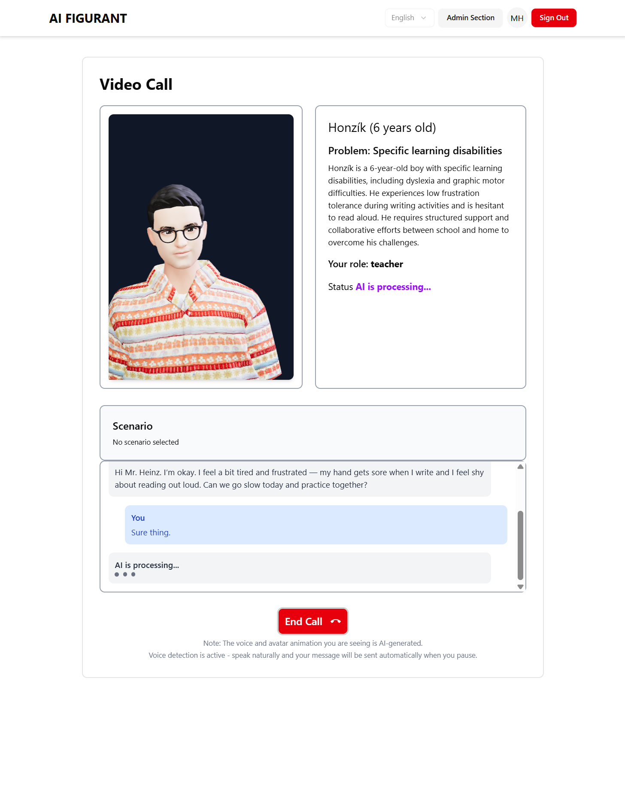
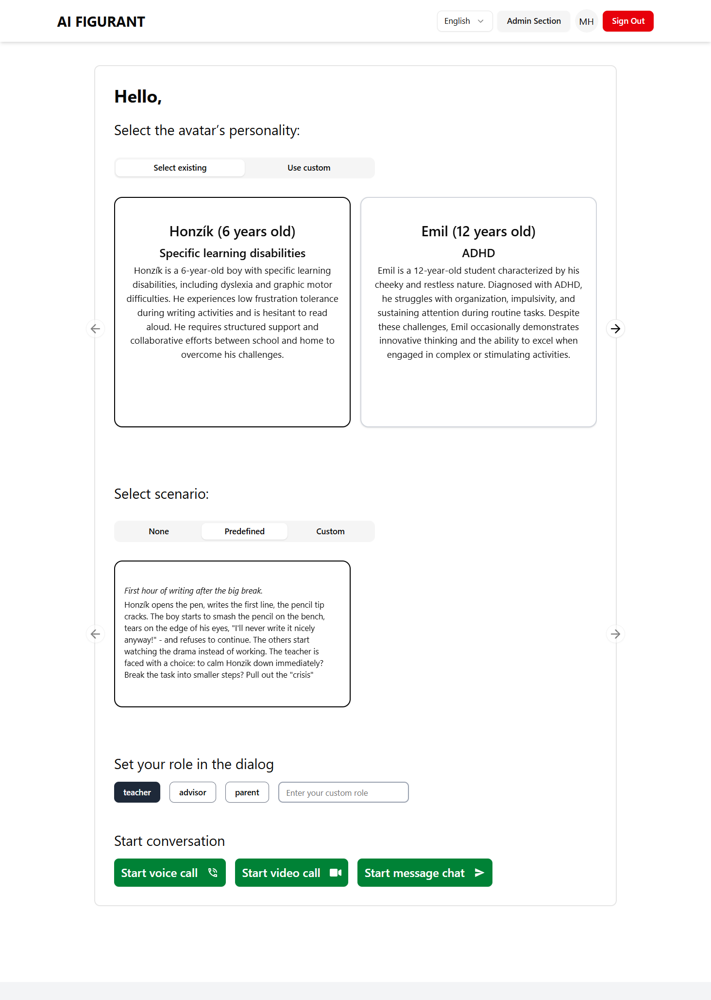
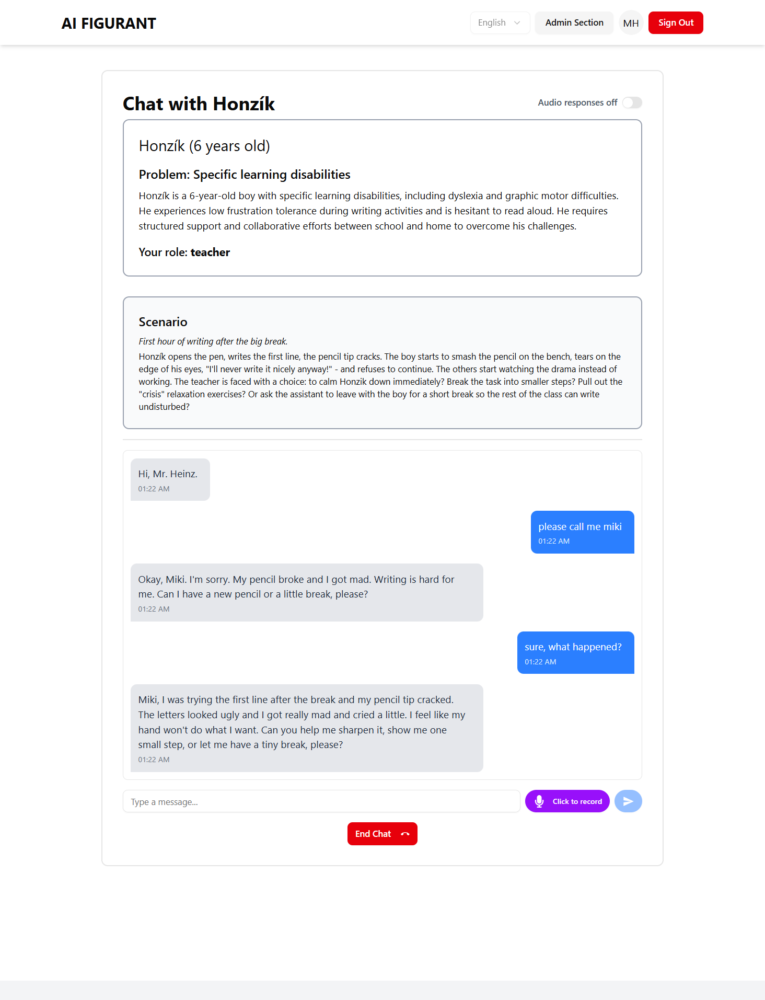
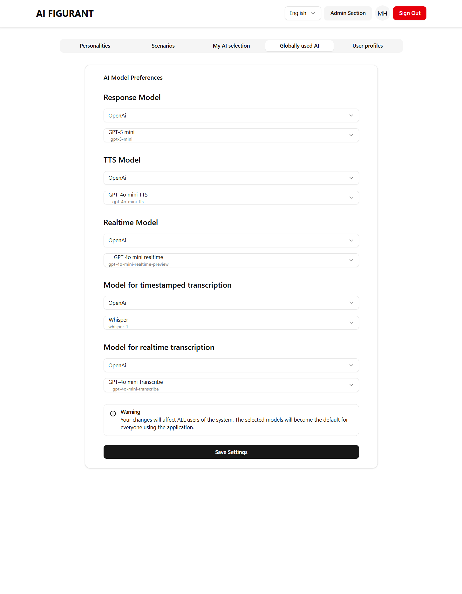

# AI Conversation Partner for Practicing Classroom Communication
_aka my Master's thesis at Masaryk University's software engineering program in 2025_

A multi-platform AI simulation environment for practicing pedagogical conversations. It provides web (Vite), desktop (Tauri), and backend (Express) packages for real-time and asynchronous dialogue with AI-driven characters, using configurable providers (OpenAI, xAI, ElevenLabs,... ). Postgres powers auth and storage, with Docker for deployment.

This application provides pedagogy students with realistic training scenarios featuring virtual students, parents, and colleagues.

## Key Features

- **Conversation Practice**: Students engage with AI-powered virtual stakeholders that respond naturally to different teaching situations
- **Flexible Communication**: 
    - Real-time voice-only conversations using OpenAI's Realtime API
    - Asynchronous chat-like text message conversations (mimicking SMS or WhatsApp)
    - Video calls like conversations with avatars rendered using [TalkingHead](https://github.com/met4citizen/TalkingHead)
- **Safe Learning Environment**: Practice challenging conversations without real-world consequences
- **Adaptive AI Behavior**: Virtual characters respond, according to designed behavioral blueprints

## Use Cases

- **Student Teachers**: Practice parent-teacher conferences, student counseling, and classroom management
- **Education Programs**: Supplement traditional teaching practice with controlled simulation exercises
- **Professional Development**: Experienced educators can rehearse challenging conversations

## Technology

Built using modern large language models and avatar rendering technologies to create immersive, educational training experiences.
- OpenAI SDK
- xAi SDK
- Anthropic SDK
- Turborepo
- Vite for web app, Tauri for desktop app, Tsup for backend

## Screenshots
### Character and Scenario Selection
Select virtual characters and scenarios to practice specific conversations or create a custom setup.

### Text message chat
Communicate with AI characters like in a messaging app.

### Voice call
Engage in real-time voice conversations with AI characters 

### Admin section
Managing existing characters and scenarios or creating new ones. Also selecting models used for responses, TTS, and STT by every user or overriding the selection for admin's own account.

