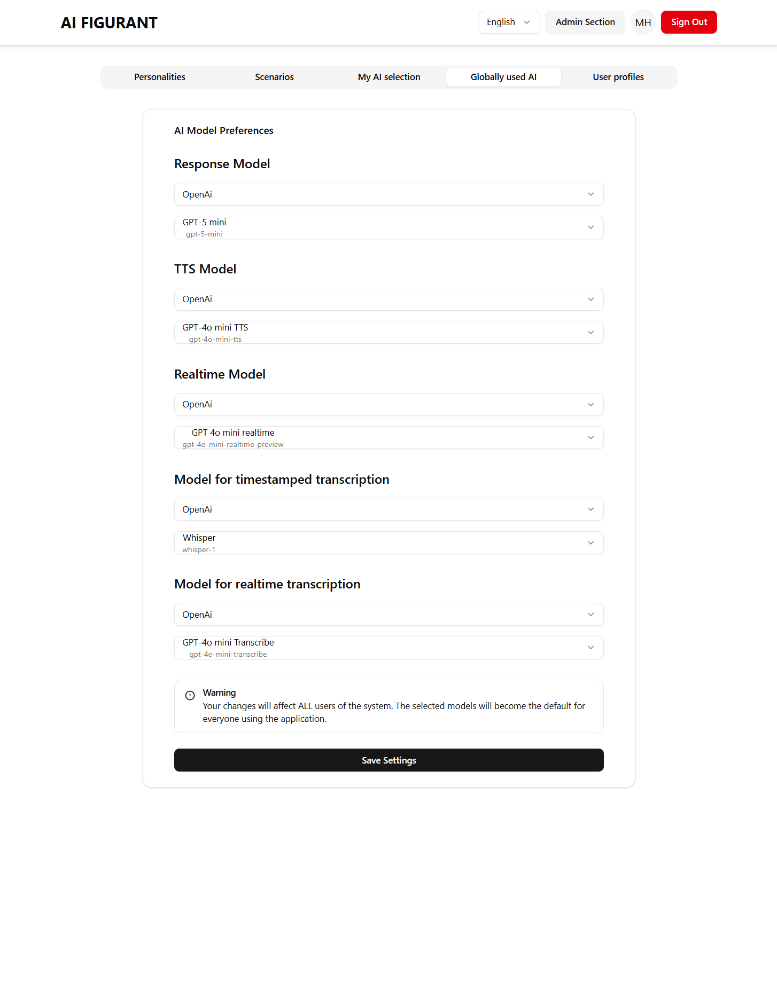

# AI Conversation Partner for Practicing Classroom Communication
_aka my Master's thesis at Masaryk University software engineering program in 2025_

An AI-powered simulation platform that helps students of pedagogical faculty practice classroom conversations in a safe, controlled virtual environment.
This application provides pedagogy students with realistic training scenarios featuring virtual students, parents, and colleagues.

## Key Features

- **Conversation Practice**: Students engage with AI-powered virtual stakeholders that respond naturally to different teaching situations
- **Flexible Communication**: 
    - Real-time voice-only conversations using OpenAI's Realtime API
    - Asynchronous chat-like text message conversations (mimicking SMS or WhatsApp)
    - Video calls like conversations with avatars rendered using [TalkingHead](https://github.com/met4citizen/TalkingHead)
- **Safe Learning Environment**: Practice difficult conversations without real-world consequences
- **Adaptive AI Behavior**: Virtual characters respond, according to designed behavioral blueprints

## Use Cases

- **Student Teachers**: Practice parent-teacher conferences, student counseling, and classroom management
- **Education Programs**: Supplement traditional teaching practice with controlled simulation exercises
- **Professional Development**: Experienced educators can rehearse challenging conversations

## Technology

Built using modern large language models and avatar rendering technologies to create immersive, educational training experiences.
- OpenAI SDK
- xAi SDK
- Anthropic SDK
- Turborepo
- Vite for web app, Tauri for desktop app, Tsup for backend

## Screenshots

